# WebSocket Device Dashboard - Complete Architecture

## System Overview

Real-time device monitoring system using Spring Boot WebSocket backend and Angular frontend with support for large payloads, FCM integration, and MongoDB persistence.

---

## High-Level Architecture

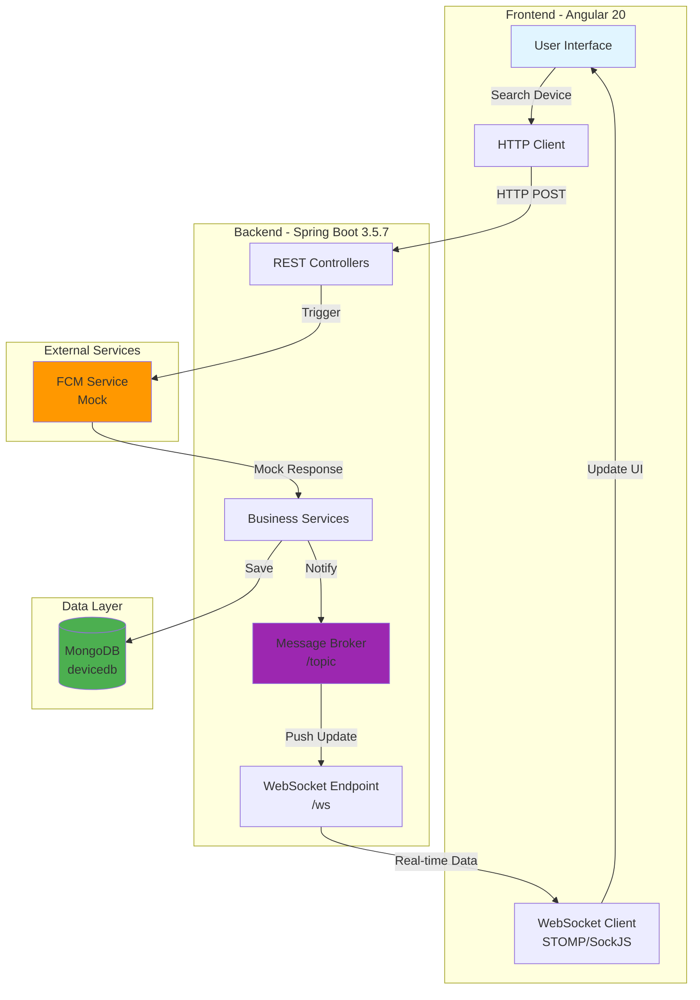

---

## Component Architecture

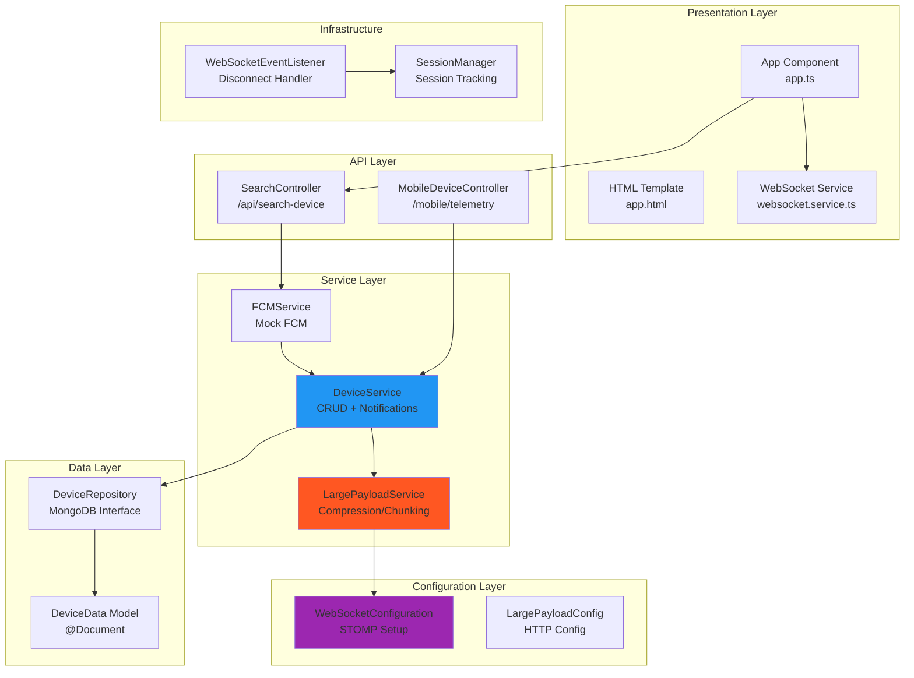

---

## Data Flow Architecture

### 1. Device Search Flow

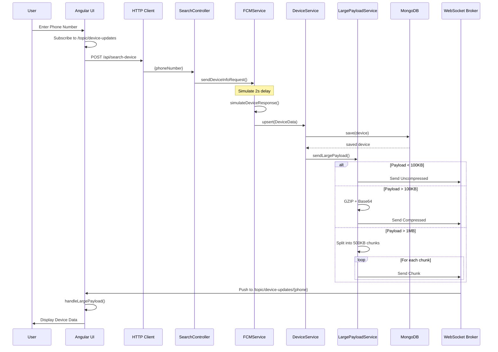

### 2. WebSocket Connection Flow

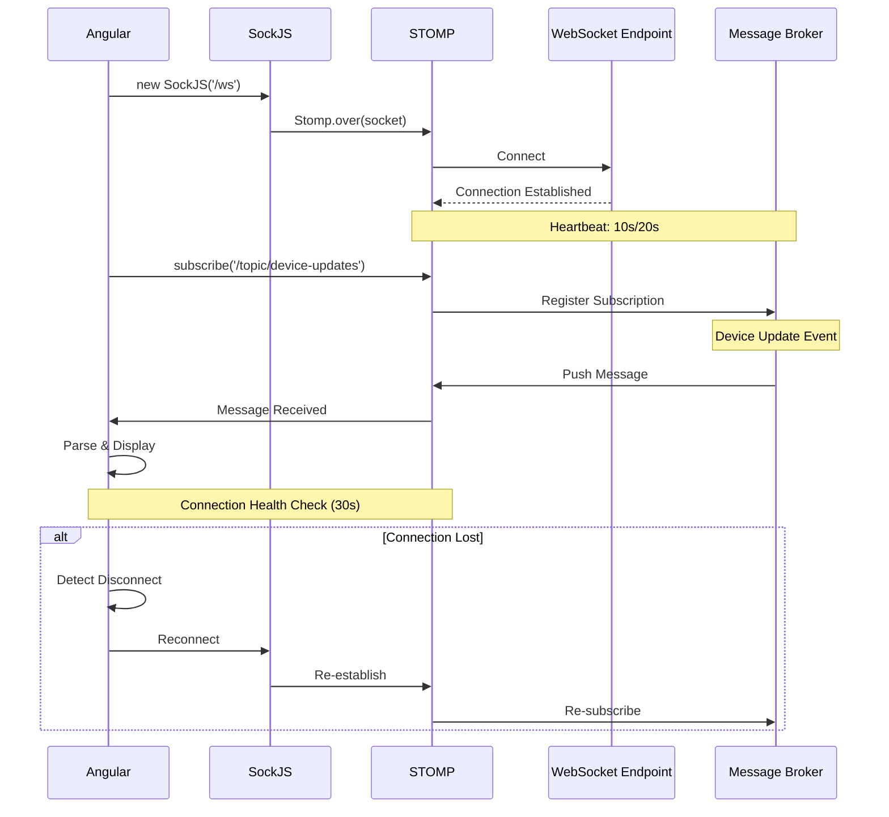

---

## Payload Processing Architecture

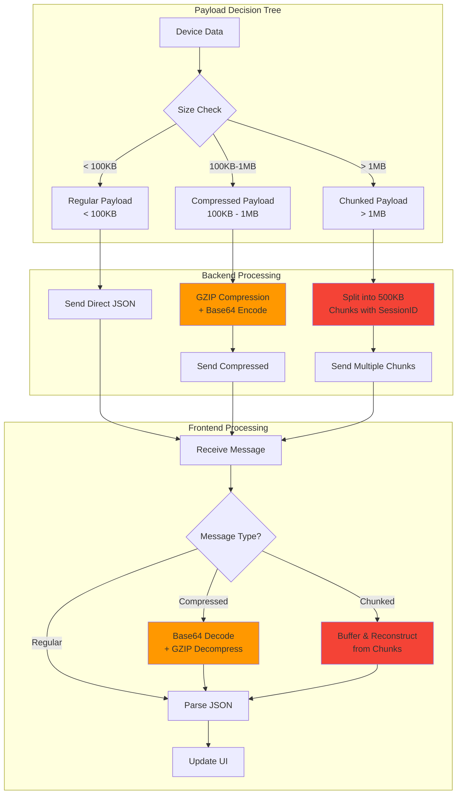

---

## Database Schema

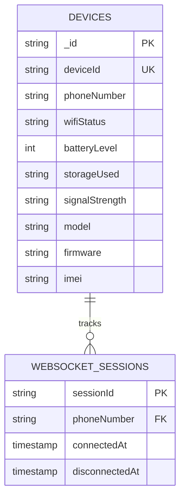

---

## Technology Stack

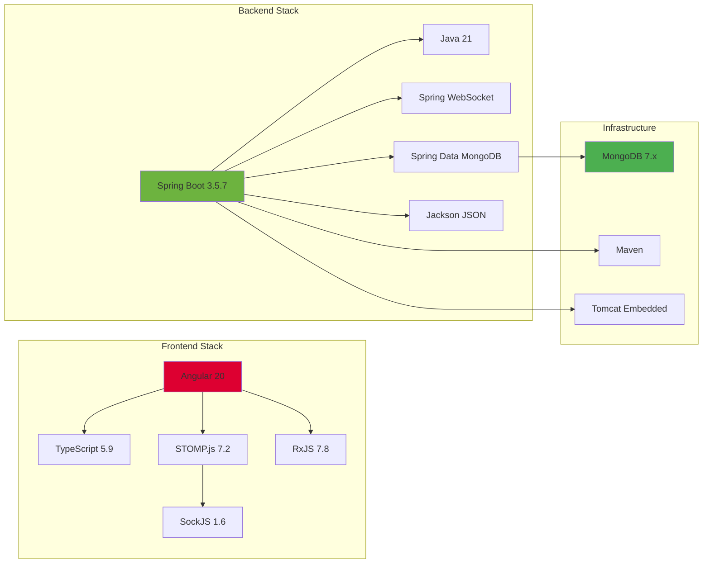

---

## WebSocket Configuration Details

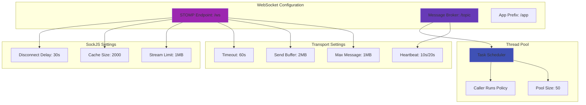

---

## REST API Endpoints

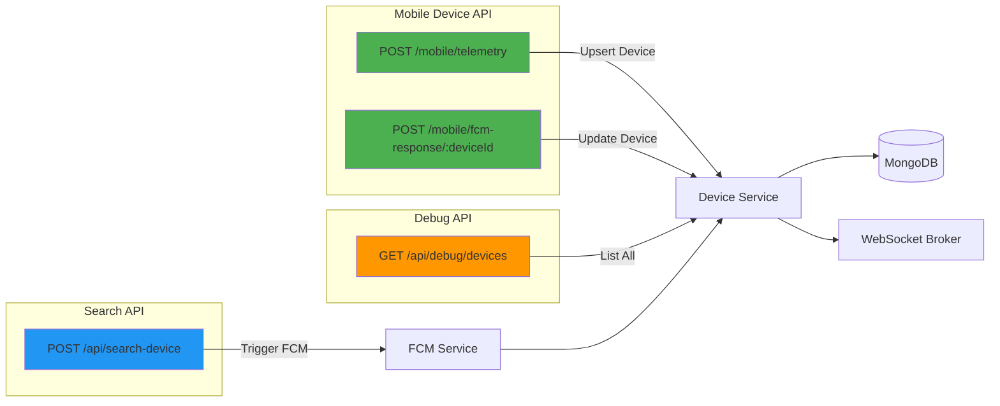

---

## WebSocket Topics

```mermaid
graph TB
    subgraph "Topic Structure"
        ROOT[/topic]
        GENERAL[/topic/device-updates]
        PHONE[/topic/device-updates/:phoneNumber]
    end
    
    subgraph "Message Types"
        REGULAR[Regular Message<br/>compressed: false]
        COMPRESSED[Compressed Message<br/>compressed: true]
        CHUNKED[Chunked Message<br/>chunked: true]
    end
    
    ROOT --> GENERAL
    ROOT --> PHONE
    
    GENERAL --> REGULAR
    PHONE --> REGULAR
    PHONE --> COMPRESSED
    PHONE --> CHUNKED
    
    style PHONE fill:#2196f3
    style COMPRESSED fill:#ff9800
    style CHUNKED fill:#f44336
```

---

## Message Formats

### Regular Message
```json
{
  "compressed": false,
  "data": {
    "deviceId": "DEVICE_001",
    "phoneNumber": "1234567890",
    "wifiStatus": "Connected",
    "batteryLevel": 85,
    "storageUsed": "32",
    "signalStrength": "Excellent",
    "model": "iPhone 14",
    "firmware": "iOS 17.1",
    "imei": "IMEI_123456789"
  },
  "timestamp": 1234567890000
}
```

### Compressed Message
```json
{
  "compressed": true,
  "data": "H4sIAAAAAAAA/6tWKkktLlGyUlAqS8wpTtVRKi1OLUpV0lFQSixOTc...",
  "originalSize": 150000,
  "compressedSize": 45000,
  "timestamp": 1234567890000
}
```

### Chunked Message
```json
{
  "chunked": true,
  "sessionId": "session_1234567890_456",
  "chunkIndex": 0,
  "totalChunks": 5,
  "data": "chunk-data-here...",
  "timestamp": 1234567890000
}
```

---

## Service Layer Architecture

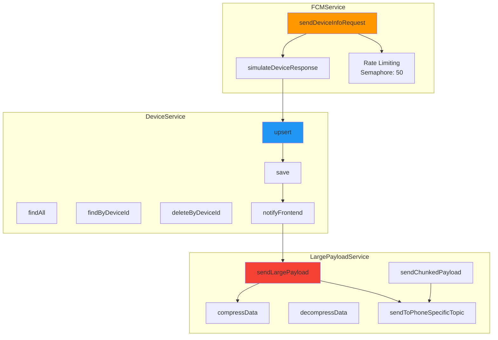

---

## Frontend State Management

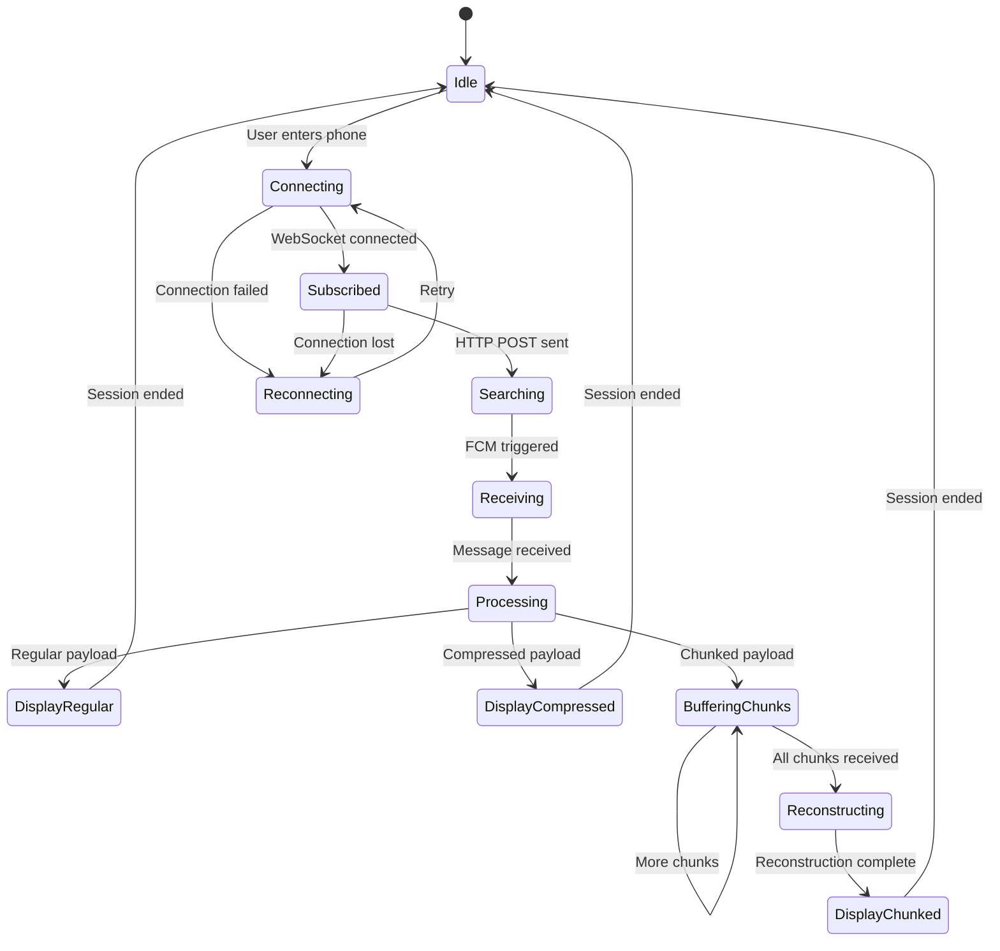

---

## Error Handling & Resilience

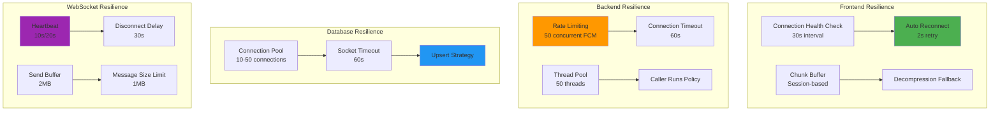

---

## Performance Optimization

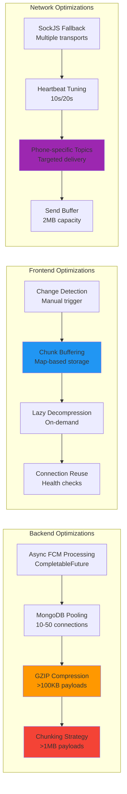

---

## Deployment Architecture

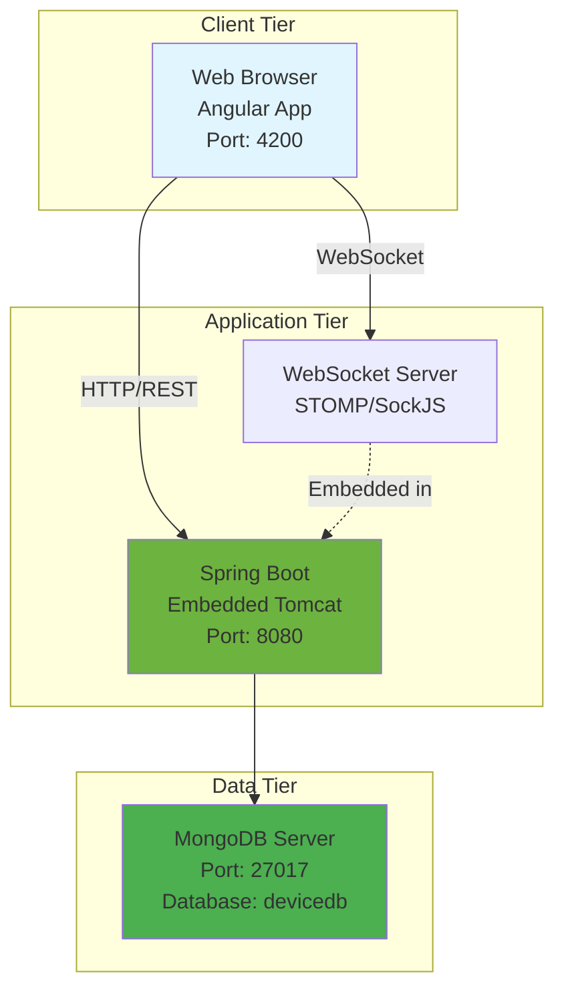

---

## Security Considerations

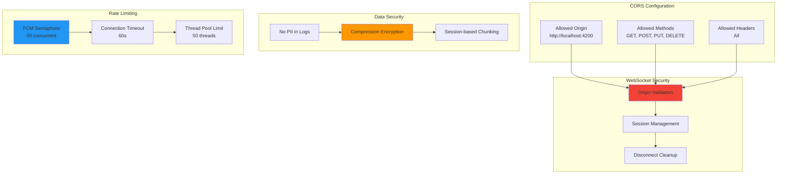

---

## Key Design Patterns

### 1. **Repository Pattern**
- `DeviceRepository` extends `MongoRepository`
- Abstraction over data access layer

### 2. **Service Layer Pattern**
- `DeviceService`: Business logic
- `FCMService`: External service integration
- `LargePayloadService`: Payload processing

### 3. **Observer Pattern**
- WebSocket message broker
- Real-time notifications to subscribers

### 4. **Strategy Pattern**
- Payload handling based on size
- Regular / Compressed / Chunked strategies

### 5. **Singleton Pattern**
- Spring beans (services, repositories)
- SessionManager for tracking

### 6. **Factory Pattern**
- WebSocket connection creation
- STOMP client instantiation

---

## Scalability Considerations

```mermaid
graph TB
    subgraph "Horizontal Scaling"
        H1[Load Balancer]
        H2[Multiple Spring Boot Instances]
        H3[Sticky Sessions for WebSocket]
    end
    
    subgraph "Vertical Scaling"
        V1[Thread Pool Size: 50]
        V2[MongoDB Pool: 10-50]
        V3[Buffer Sizes: 1-2MB]
    end
    
    subgraph "Data Scaling"
        D1[MongoDB Sharding]
        D2[Index on deviceId]
        D3[Index on phoneNumber]
    end
    
    subgraph "Message Scaling"
        M1[Phone-specific Topics]
        M2[Compression for Large Data]
        M3[Chunking for Very Large Data]
    end
    
    H1 --> H2
    H2 --> H3
    
    V1 --> V2
    V2 --> V3
    
    D1 --> D2
    D2 --> D3
    
    M1 --> M2
    M2 --> M3
    
    style H3 fill:#9c27b0
    style V1 fill:#2196f3
    style D1 fill:#4caf50
    style M2 fill:#ff9800
```

---

## Monitoring & Logging

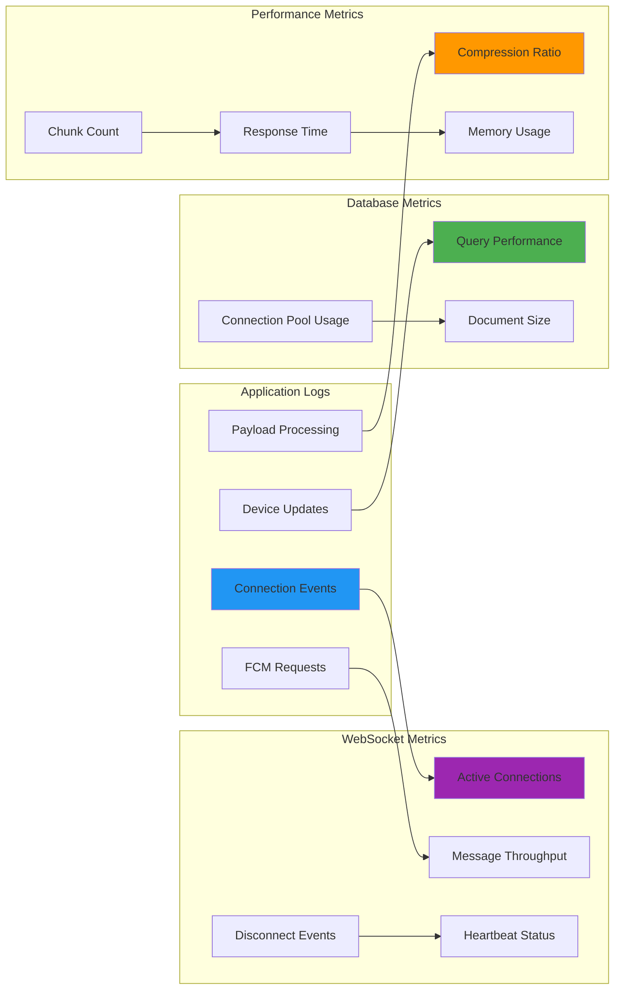

---

## Future Enhancements

1. **Authentication & Authorization**
   - JWT token-based auth
   - Role-based access control
   - Secure WebSocket connections

2. **Real FCM Integration**
   - Replace mock FCM with actual Firebase
   - Handle FCM token management
   - Push notification delivery

3. **Advanced Monitoring**
   - Prometheus metrics
   - Grafana dashboards
   - Alert management

4. **Clustering Support**
   - Redis for session sharing
   - Message broker (RabbitMQ/Kafka)
   - Distributed caching

5. **Enhanced Error Handling**
   - Circuit breaker pattern
   - Retry mechanisms
   - Dead letter queues

---

## Summary

This architecture provides:

✅ **Real-time Communication**: WebSocket with STOMP protocol  
✅ **Large Payload Support**: Compression (>100KB) and Chunking (>1MB)  
✅ **Scalability**: Thread pooling, connection pooling, rate limiting  
✅ **Resilience**: Auto-reconnect, health checks, error handling  
✅ **Performance**: Async processing, targeted topics, optimized buffers  
✅ **Maintainability**: Clean separation of concerns, service layer pattern  

The system efficiently handles device monitoring with real-time updates while managing large data payloads through intelligent compression and chunking strategies.
