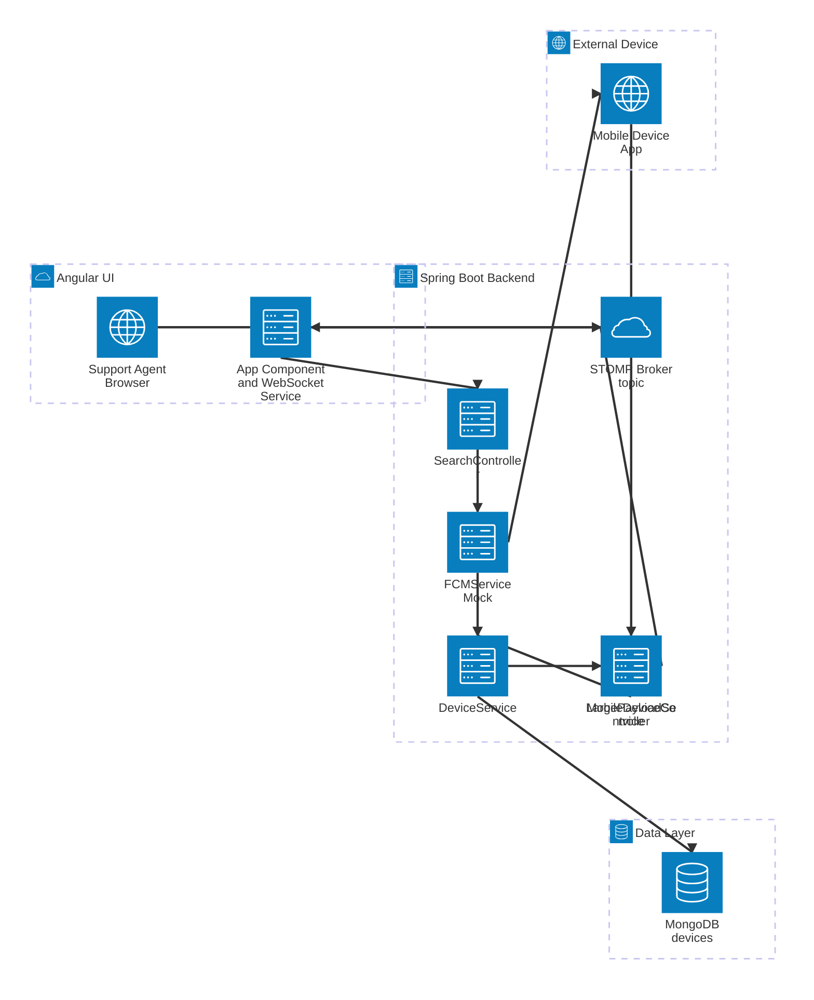
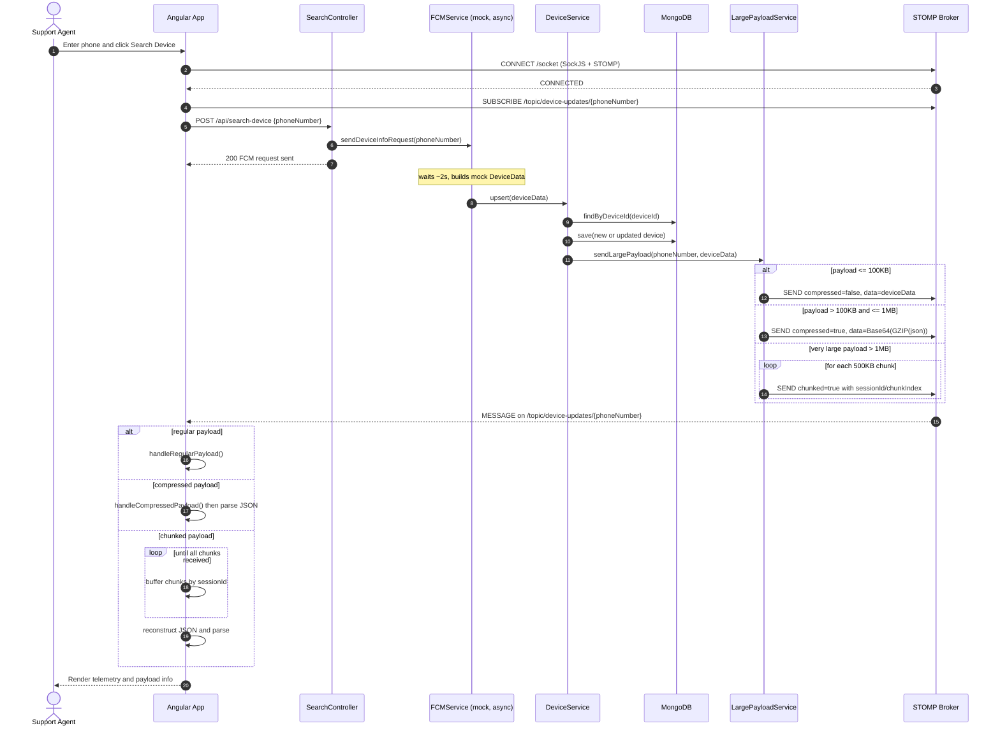

# Real-Time Device Dashboard Architecture

## Overview
A web-based dashboard application used by support agents to troubleshoot issues on customer mobile devices in real-time. The system provides live telemetry data, device information, and enables remote device management through Firebase Cloud Messaging (FCM).

## System Architecture

### High-Level Flow
```
Angular UI → Spring Boot → FCM → Mobile Device → Spring Boot → MongoDB → WebSocket → Angular UI
```

### Mermaid Architecture Diagram



### Mermaid Sequence Diagram



### Components

#### 1. Frontend (Angular)
- **Technology**: Angular 20.3.0 with TypeScript
- **Purpose**: Support agent dashboard interface
- **Key Features**:
  - Phone number search functionality
  - Real-time device telemetry display
  - WebSocket connection for live updates
  - Responsive UI for device monitoring

#### 2. Backend (Spring Boot)
- **Technology**: Spring Boot with Java
- **Purpose**: API gateway and business logic layer
- **Key Components**:
  - REST API endpoints
  - WebSocket configuration
  - FCM integration
  - MongoDB data persistence

#### 3. Database (MongoDB)
- **Technology**: MongoDB NoSQL database
- **Purpose**: Device data storage and retrieval
- **Collections**: Device telemetry and configuration data

#### 4. Messaging (Firebase Cloud Messaging)
- **Technology**: FCM for push notifications
- **Purpose**: Communication with mobile devices
- **Implementation**: Mock FCM service for testing

## Detailed Architecture

### Data Flow

1. **Device Search Initiation**
   - Support agent enters phone number in Angular UI
   - Angular sends HTTP POST to `/api/search-device`
   - Spring Boot receives request and triggers FCM service

2. **FCM Communication**
   - FCM service sends push notification to mobile device
   - Mobile device processes request and prepares telemetry data
   - Device responds with current status information

3. **Data Persistence**
   - Spring Boot receives device response via `/mobile/telemetry`
   - Device data is validated and stored in MongoDB
   - WebSocket notification is triggered automatically

4. **Real-Time Updates**
   - WebSocket pushes device data to connected Angular clients
   - Angular UI updates dashboard with latest telemetry
   - Support agent sees real-time device information

### API Endpoints

#### Frontend APIs
```
POST /api/search-device
- Initiates device search by phone number
- Triggers FCM notification to mobile device

GET /api/devices
- Retrieves all device records

GET /api/devices/{deviceId}
- Retrieves specific device information

POST /api/devices
- Creates new device record

PUT /api/devices/{deviceId}
- Updates existing device record

DELETE /api/devices/{deviceId}
- Removes device record
```

#### Mobile Device APIs
```
POST /mobile/telemetry
- Receives device telemetry data
- Performs upsert operation (create or update)

POST /mobile/fcm-response/{deviceId}
- Handles FCM command responses
- Updates device status based on response
```

#### Testing APIs
```
POST /test/websocket
- Sends test WebSocket message
- Used for development and debugging
```

### WebSocket Configuration

#### Connection Details
- **Endpoint**: `/socket`
- **Protocol**: STOMP over SockJS
- **Topic**: `/topic/device-updates`
- **Message Format**: JSON with device data and metadata

#### Message Structure
```json
{
  "deviceId": "DEVICE_1234",
  "data": {
    "deviceId": "DEVICE_1234",
    "phoneNumber": "1234567890",
    "wifiStatus": "Connected",
    "batteryLevel": 85,
    "storageUsed": "32",
    "signalStrength": "Strong",
    "model": "iPhone 14",
    "firmware": "iOS 17.1",
    "imei": "123456789012345"
  },
  "timestamp": 1699123456789
}
```

### Database Schema

#### DeviceData Collection
```json
{
  "_id": "ObjectId",
  "deviceId": "String (Unique)",
  "phoneNumber": "String",
  "wifiStatus": "String",
  "batteryLevel": "Integer",
  "storageUsed": "String",
  "signalStrength": "String",
  "model": "String",
  "firmware": "String",
  "imei": "String",
  "createdAt": "Date",
  "updatedAt": "Date"
}
```

## Technology Stack

### Frontend
- **Framework**: Angular 20.3.0
- **Language**: TypeScript 5.9.2
- **UI Components**: Angular Common, Forms
- **HTTP Client**: Angular HttpClient
- **WebSocket**: SockJS + STOMP.js

### Backend
- **Framework**: Spring Boot
- **Language**: Java
- **Database**: Spring Data MongoDB
- **WebSocket**: Spring WebSocket with STOMP
- **Messaging**: Firebase Cloud Messaging (FCM)

### Infrastructure
- **Database**: MongoDB
- **Development Server**: Angular CLI (ng serve)
- **Application Server**: Spring Boot embedded Tomcat
- **Ports**: Angular (4200), Spring Boot (8080), MongoDB (27017)

## Configuration

### Angular Configuration
```typescript
// app.config.ts
providers: [
  provideHttpClient(),
  // Other providers
]
```

### Spring Boot Configuration
```yaml
# application.yml
spring:
  data:
    mongodb:
      uri: mongodb://localhost:27017/devicedb
server:
  port: 8080
```

### CORS Configuration
```java
@Configuration
public class CorsConfig {
  // Allows Angular (localhost:4200) to access Spring Boot APIs
}
```

## Security Considerations

### CORS Policy
- Configured to allow requests from Angular development server
- Production deployment requires proper domain configuration

### Data Validation
- Input validation on all API endpoints
- Phone number format validation
- Device data sanitization

### Error Handling
- Graceful error handling in Angular UI
- Proper HTTP status codes from Spring Boot
- WebSocket connection error recovery

## Deployment Architecture

### Development Environment
```
┌─────────────┐    ┌─────────────┐    ┌─────────────┐
│   Angular   │    │ Spring Boot │    │   MongoDB   │
│ localhost:  │◄──►│ localhost:  │◄──►│ localhost:  │
│    4200     │    │    8080     │    │   27017     │
└─────────────┘    └─────────────┘    └─────────────┘
```

### Production Considerations
- Load balancing for multiple Angular instances
- Database clustering for high availability
- FCM service integration with proper authentication
- SSL/TLS encryption for all communications
- Monitoring and logging infrastructure

## Performance Optimizations

### Frontend
- Change detection optimization with ChangeDetectorRef
- Lazy loading for large device lists
- WebSocket connection pooling

### Backend
- Database indexing on deviceId and phoneNumber
- Connection pooling for MongoDB
- Asynchronous FCM processing
- Caching for frequently accessed device data

### Real-Time Updates
- Efficient WebSocket message broadcasting
- Selective updates based on user context
- Message queuing for offline scenarios

## Testing Strategy

### Unit Testing
- Angular component testing with Jasmine/Karma
- Spring Boot service layer testing with JUnit
- Mock FCM service for integration testing

### Integration Testing
- End-to-end API testing
- WebSocket connection testing
- Database integration testing

### Mock Services
- Mock FCM service simulates real device responses
- Configurable delays and random data generation
- Support for multiple device scenarios

## Monitoring and Logging

### Application Metrics
- WebSocket connection count
- API response times
- Database query performance
- FCM delivery success rates

### Error Tracking
- Frontend error logging
- Backend exception handling
- Database connection monitoring
- WebSocket connection failures

## Future Enhancements

### Scalability
- Microservices architecture
- Message queue integration (RabbitMQ/Apache Kafka)
- Horizontal scaling with load balancers

### Features
- Multi-tenant support for different organizations
- Advanced device filtering and search
- Historical data analytics and reporting
- Automated alert system for device issues

### Security
- JWT-based authentication
- Role-based access control
- API rate limiting
- Data encryption at rest and in transit
